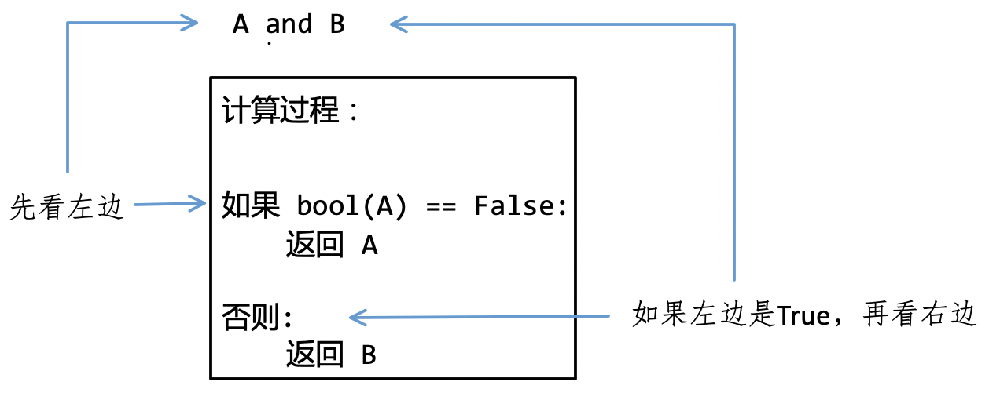
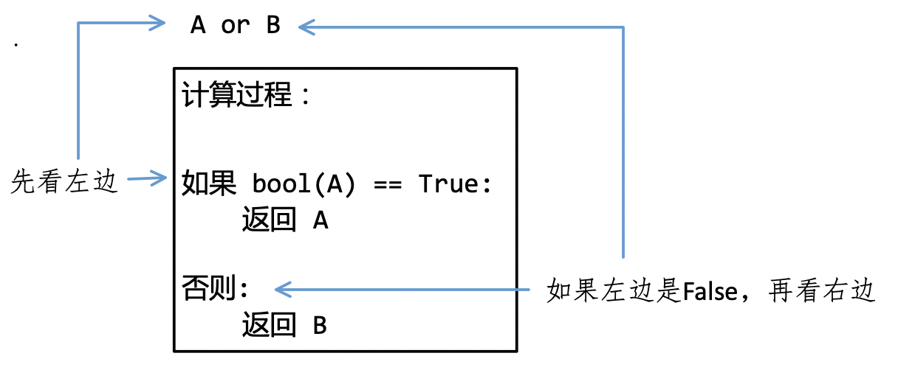

## 关注微信公众号：**老齐教室** 。阅读更多有深度的技术文章。

# 版次：2019年3月第1版

## 印次：2019年3月第1次印刷

**相关术语说明：**

- 正文：不包含代码部分的文字内容
- 正数：即从页面顶部开始向下计数
- 倒数：即从页面底部开始向上计数
- 原文：即原来的叙述。如果针对原来内容有修改，则用删除符号（~~删除符号~~）标示。
- 修订：即相应内容修改之后的最终效果
- 说明：对所修改内容的说明

----

1. 页码：001
   - 行数：正文，正数第2行
   - 原文：~~当然，~~现在本星球上的编程语言比较多，
   - 修订：现在本星球上的编程语言比较多，
   - 说明：删除原文中的“当然”
2. 页码：001
   - 行数：正文，正数第3行
   - 原文：~~本章将简要介绍一些相关的基本知识，并~~最终确定本书要学习的语言Python。
   - 修订：编程语言的发展遵循着一定规律，其结构也符合特定的规章。本章将在对编程语言一般地简要理解基础上，最终确定本书要学习的语言Python。
   - 说明：将“本章将简要......知识，并”删除，并用指定内容替换。
3. 页码：014
   - 行数：正文，正数第3行
   - 原文：特别推荐~~使用~~Ubuntu操作系统。
   - 修订：特别推荐Ubuntu操作系统。
   - 说明：删除“使用”二字。
4. 页码：016
  
   - 行数：正文，倒数第8行
   - 原文：读者可以通过修改软~~连~~接，……，关键词就是“Ubuntu 修改软~~连~~接”
   - 修订：读者可以通过修改软链接，……，关键词就是“Ubuntu 修改软链接”
   - 说明：“连接”修改为“链接”。
5. 页码：016

   - 行数：正文，倒数第4行
   - 原文：出现图~~2-2-4~~所示的界面。
   - 修订：出现图2-2-5所示的界面。
   - 说明：“图2-2-4”修改为“图2-2-5”
6. 页码：017

   - 行数：正文，倒数第6行，倒数第4行。
   - 原文：即Python 3的~~软连接~~指向的是Python 3.5。…… 可以按照自己的需要修改~~软连接~~。
   - 修订：即Python 3的软链接指向的是Python 3.5。…… 可以按照自己的需要修改软链接。
   - 说明：“连接”修改为“链接”。
7. 页码：021

   - 行数：图2-2-17文字说明第2行
   - 原文：注意写法，~~左~~后要有“\”
   - 修订：注意写法，最后要有“\”
   - 说明：“左”修改为“最”。
8. 页码：024

   - 行数：图2-2-22的文字说明
   - 原文：如果只安装了Python 3或者修改了软~~连接~~
   - 修订：如果只安装了Python 3或者修改了软链接
   - 说明：“连接”修改为“链接”。
9. 页码：025

   - 行数：“练习和编程2”的第3题。
   - 原文：在~~使用~~Ubuntu操作系统 …… 到第1章“练习和编程”
   - 修订：在Ubuntu操作系统 …… 到第1章“练习和编程1”
   - 说明：删除“使用”二字；将“练习和编程”修改为“练习和编程1”。 
10. 页码：027

   - 行数：倒数第1行
   - 原文：用符号表示就是int。
   - 修订：用符号int表示。
11. 页码：030

    - 行数：正文，正数第4段第1行
    - 原文：~~上面这种提问~~，在数学中或许容易回答，
    - 修订：此问题，在数学中或许容易回答，
    - 说明：将“上面这种提问”修改为“此问题”。
12. 页码：039

    - 行数：正文，正数第2行

    - 原文：想让计算机能够处理字符，也要如此~~处理~~，必须~~把~~字符与二进制的为（bit）之间建立起~~一个~~对应关系，这种对应关系~~被~~称为“字符编码”。
    - 修订：想让计算机能够处理字符，也要如此，必须将字符与二进制的为（bit）之间建立起对应关系，这种对应关系称为“字符编码”。
    - 说明：删除原来的“处理”、“一个”、“被”，并将原句中的“把”修改为“将”。
13. 页码：041

    - 行数：正文，正数第1行
    - 原文：尽管是数字，….，变成了字符串。这种由数字组成的字符串可以通过int~~函数~~和str~~函数~~实现相互间的类型转化。
    - 修订：尽管是数字，….，变成了字符串。表象上看，这种由数字组成的字符串可以通过int和str实现相互间的类型转化，实质上，int('250')是以字符串“250”为参数创建一个整数类型实例（对此句的理解请参阅本书第6章内容）。
    - 说明：
      - 增加“表象上看”
      - 删除“函数”、“函数”
      - 增加：实质上…实例（对此句…内容）。
14. 页码：044

    - 行数：正文，倒数第2行
    - 增加一段：请思考并尝试：len("大学")的返回值是多少？在此基础上进一步体会帮助文档的说明。
    - 说明：在“4. In：判断元素是否存在其中”前面增加上述内容，并单独一个段落。 
15. 页码：052
- 行数：正文，正数第2行
    - 原文：2. 分~~隔~~和组合
    - 修订：2. 分割和组合
    - 说明：将原文中的“隔”修改为“割”。
16. 页码：067
    - 行数：正文，倒数第4自然段，第1行
    - 原文：~~在一个~~字典中，“键”必须满足如下条件：
    - 修订：字典中，“键”必须满足如下条件：
    - 说明：删除“在一个”。
17. 页码：074

    - 行数：正文，正数第4自然段第2行
    - 原文：它独立~~称~~为一个语句，
    - 修订：它独立成为一个语句，
    - 说明：原句中的“称”修改为“成”。
18. 页码：076

    - 行数：正文第2自然段。
    - 原文：可以理解为深度拷贝就是复制过程的递归。
    - 修订：可以将深度拷贝理解为复制过程的递归，即将容器中的容器也复制。
    - 说明：如修订，修改原文表述顺序，并增加一句。
19. 页码：076

    - 行数：正文倒数第2自然段
    - 原文：~~使用对象是可变的~~容器对象，对数字、字符串等没有“拷贝”操作。
    - 修订：复制的是容器对象（区别在于一层还是多层），对数字、字符串等没有“拷贝”操作。
    - 说明：将原句中的“使用对象是可变的”修改为“复制的是”，并增加“（区别在于一层还是多层）”
20. 页码：089

    - 行数：正文，正数第2自然段
    - 原文：这就好比自然语言中~~的字词那样~~，要想然字词能表达某种意思，
    - 修订：这就好比在自然语言中，要想让字词能表达某种意思，
    - 说明：
      - 增加“在”字
      - 删除“的字词那样”
21. 页码：090

    - 行数：正文，倒数第1段
    - 原文：并且逐个字符进行比较，~~如果相等，则返回True。如果每个字符串都比较完毕，不等式仍然不成立，则返回False~~。
    - 修订：并且逐个字符进行比较，如果比较关系对于每两个对应字符都成立，则返回True，否则返回False。
    - 说明：删除原句中“如果相等…则返回False”，修改为“如果比较关系…返回False”。
22. 页面：092

    - 行数：正文，倒数第2自然段
    - 原文：它们是Python的内置对象~~类型~~。
    - 修订：它们是Python的内置对象。
    - 说明：删除原文中的“类型”。
23. 页面：093

    - 行数：图4-1-1
    - 说明：将原图4-1-1用下面的图示替换。
    - 
24. 页面：094

    - 行数：图4-1-2
    - 说明：将原图4-1-2用下面的图示替换。
    - 
25. 页面：094

    - 行数：正文，标题“3. not”下第1行
    - 原文：~~Not~~为“非”运算，
    - 修订：not为“非”运算，
    - 说明：将原文中首字母大写的“Not”修改为“not”
26. 页面：095

    - 行数：正文，倒数第5自然段
    - 原文：e，~~作为数学常数，是自然对数函数的底数，有时~~称为欧拉数（Euler's number），
    - 修订：e，自然常数，也称为欧拉数（Euler's number），
    - 说明：删除原文“作为数学常数，…，有时”，并替换为“自然常数，也”。
27. 页面：095

    - 行数：正文，倒数第2自然段
    - 原文：~~这里以math标准库为例，~~演示了import语句的不同使用方式。
    - 修订：以上演示了import语句的不同使用方式。
    - 说明：删除“这里以math标准库为例，”，并在替换“以上”。
28. 页面：099
- 行数：正文，倒数第3自然段
    - 原文：①在“for i in ~~hello~~: ”中， for是发起循环的关键词，“i in ~~hello~~”是循环规则。
    - 修订：①在“for i in h: ”中， for是发起循环的关键词，“i in h”是循环规则（h = 'hello'）。
    - 说明：原文中的hello，改为：h。
28. 页面：106
    - 行数：正文，倒数第1行
    - 原文：【例题4-4-7】有列表mybag = ['glass', 'apple', 'green leaf']，
    - 修订：【例题4-4-7】有列表mybag = [' glass', ' apple ', 'green leaf ']，
    - 说明：列表中，第一个元素的的单词前面有一个空格；第二个元素单词两边都有空格，第三个元素最后一个单词右边有一个空格。
29. 页面：109

    - 行数：正文，正数第4自然段
    - 原文：“猜中~~中~~止”，……，利用break~~中~~止循环
    - 修订：“猜中终止”，……，利用break终止循环
    - 说明：将“中止”修改为“终止”。
30. 页面：110

    - 行数：正文，正数第3行
    - 原文：~~中~~止循环（break）
    - 修订：终止循环（break）
    - 说明：将“中止”修改为“终止”。
31. 页面：114

    - 行数：正文，正数第8行
    - 原文：⑦通常的函数……，返回一个值（即对象）。
    - 修订：⑦通常的函数……，返回一个或多个值（即对象）。
    - 说明：将“返回一个值”修改为“返回一个或多个值”。
32. 页面：130

    - 行数：正文，倒数第2自然段、倒数第1自然段。
    - 原文：
      - 它的名称是“装饰器~~语法糖~~”。
      - “装饰器~~语法糖~~”的作用在面的……
    - 修订：
      - 它的名称是“装饰器”。
      - “装饰器”的作用在面的……
    - 说明：删除“语法糖”三个字。
33. 页面：135
- 行数：正文，正数第3行
    - 原文：计算列表中整数的平均数和~~标注差~~。
    - 修订：计算列表中整数的平均数和标准差。
    - 说明：原文中的“标注差”修改为“标准差”。
34. 页面：137
    - 行数：正文，倒数第5段，第1行。
    - 原文：在面向对象~~程式~~设计中，类（class）是一种面向对象计算机编程语言的构造，
    - 修改：在面向对象程序设计中，类（class）是一种面向对象计算机编程语言的构造，
    - 说明：原文中的“程式”，修改为“程序”。
35. 页面：146
    - 行数：正文，正数第1行
    - 原文：③还是一个赋值语句。所以，~~这里~~“修改”变量Foo.lang~~本质上是~~引用了另一个对象。
    - 修订：③还是一个赋值语句。所以，“属性值修改”可以理解为变量Foo.lang引用了另一个对象。
36. 页面：150

    - 行数：正文，正数第5自然段第2行
    - 原文：如~~②~~所示。当用此示例调用方法的时候，……，如③和~~④~~所示。
    - 修订：如④所示。当用此示例调用方法的时候，……，如③和②所示。
    - 说明：②和④在文中调换位置。
37. 页面：153

    - 行数：正文，正数第1自然段和第2自然段。
- 原文：
  
  - ~~在类Message中定义了类属性msg……于是不得不“并编码~~
      - ~~而~~④用装饰器装饰了……~~不需要”硬编码“~~，~~改为~~cls.msg的样式。
    - 修订：
    
      - ④用装饰器装饰了……，使用cls.msg的样式。
    - 说明：
      - 删除第1自然段
      - 第2自然段，删除“而”、“不需要”硬编码””，并将“改为”替换为“使用”。

35. 页面：165
- 行数：正文，正数第5自然段
    - 原文：大师 ~~Brue~~ Eckel 在上面提到的博客中
    - 修订：大师 Bruce Eckel 在上面提到的博客中
    - 说明：将 Brue修改为Bruce
36. 页面：183
    - 行数：正文，倒数第2行
    - 原文：6.9.1 基本**~~引用~~**
    - 修订：6.9.1 基本**应用**
    - 说明：将原文中的“引用”修改为“应用”
37. 页面：192
    - 行数：正文，倒数第2自然段第2行
    - 原文：Yield即“生产”“出产”之意，
    - 修订：yield即“生产”“出产”之意，
    - 说明：将原来首字母大写改为小写。
38. 页面：193
    - 行数：正文，倒数第2自然段第1行
    - 原文：~~最后的结果~~用以往的函数知识不难理解。
    - 修订：用以往的函数知识不难理解最后的结果。
39. 页面：194
    - 行数：例题6-11-1
    - 原文：请编写一个~~迭代器~~函数
    - 修订：请编写一个生成器函数
    - 说明：将原文中的“迭代器”，修改为“生成器”
40. 页面：199
    - 行数：正文，正数第5行
    - 原文：换~~一~~个方式，能发现~~一个~~规律。
    - 修订：换个方式，能发现规律。
41. 页面：218
    - 行数：正文，倒数第2行
    - 原文：一般情况下，~~如果本地没有安装，~~pip会随python默~~然~~安装上~~，~~可以通过下列方式~~完成~~安装~~工作~~。
    - 修订：一般情况下，pip会随Python默认安装上。如果本地没有安装，可以同通过下列方式安装。
42. 页面：227
    - 行数：表5-2-1的第6行
    - 原文：请求一个不存在的字典~~关键字~~
    - 修订：请求一个不存在的字典的键
    - 说明：将原文中的“关键字”修改为“的键”。
43. 页面：230
    - 行数：正文，正数第3自然段第2行
    - 原文：所谓处理多个异常，~~是可以允许~~捕获不同的异常，由不同的except子句处理。
    - 修订：所谓处理多个异常，即捕获不同的异常，并由不同的except子句处理。